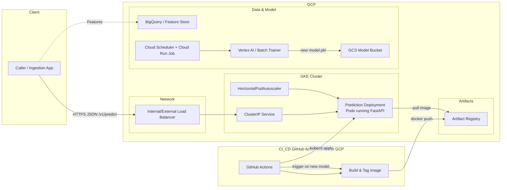

## Real-time Credit Card Fraud Detection on GKE

This repository contains a reference implementation to productionize a real-time credit card fraud detection model on Google Kubernetes Engine (GKE). It includes a containerized prediction service, Kubernetes manifests, Terraform infrastructure-as-code, and a GitHub Actions CI/CD pipeline that tests, builds, pushes, and deploys to GKE.

### Architecture Diagram



### Technology Choices & Justification
| Layer | Technology | Reason |
|-------|------------|--------|
| **Model Serving** | FastAPI (Python) + Uvicorn | Lightweight, async, easy to containerize, excellent for high‑throughput inference. |
| **Container Runtime** | Docker (multi‑stage build) | Produces minimal images, supports reproducible builds. |
| **Orchestration** | Google Kubernetes Engine (GKE) | Managed K8s service, auto‑scaling, integrates with GCP IAM & Artifact Registry. |
| **CI/CD** | GitHub Actions + Terraform | IaC for GCP resources, automated testing, image build, and deployment on push. |
| **Infrastructure** | Terraform | Declarative, version‑controlled GCP provisioning (GKE cluster, Artifact Registry, IAM). |
| **Monitoring** | GKE health probes, Cloud Monitoring | Native health checks and observability. |
| **Model Storage** | Google Artifact Registry (Docker) | Secure, private container image registry integrated with GCP. |

### Repository Layout

## Repository Structure
```
/prediction_service
    ├── app/
    │   ├── main.py          # FastAPI app
    │   ├── schemas.py        # Model loading & inference logic
    │   └── __init__.py
    ├── tests/
    │   └── test_app.py
    ├── Dockerfile
    └── requirements.txt

/k8s
    ├── deployment.yaml
    ├── service.yaml
    └── hpa.yaml            
/terraform
    ├── main.tf
    ├── variables.tf
    ├── versions.tf
    └── outputs.tf
.github/workflows
    └── deploy.yml

README.md

### Local Development

- Create a virtual environment and install `prediction_service/requirements.txt`.
- Run the service locally: `uvicorn prediction_service.app.main:app --reload`.
- POST to `/v1/predict` with JSON features; GET `/health` for health checks.

### CI/CD

- On push to `main`, pipeline runs tests, builds and pushes an image tagged with the Git SHA on GitHub-hosted runners, then updates the Kubernetes deployment to roll out the new image.

### Security

- No static keys in CI: uses OIDC-based Workload Identity Federation to obtain short-lived credentials.
- Least-privilege IAM roles for CI and node service accounts.

### Retraining Workflow

- Scheduled retraining produces a new `model.pkl` to GCS. A change-notification triggers the CI pipeline to rebuild the image embedding the new model version, pushing to Artifact Registry, and rolling out to GKE.
